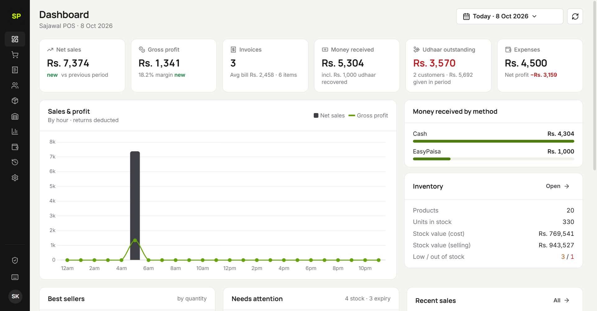
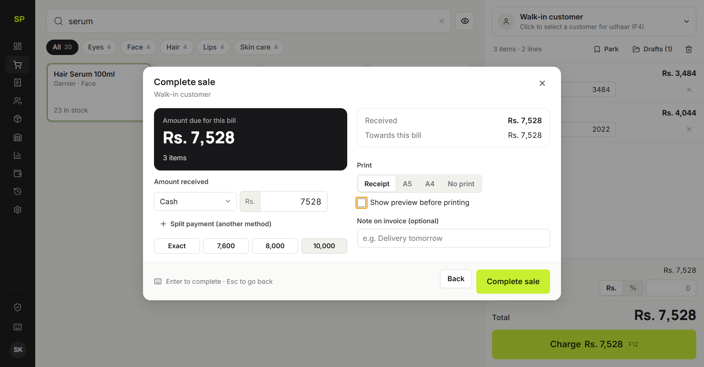
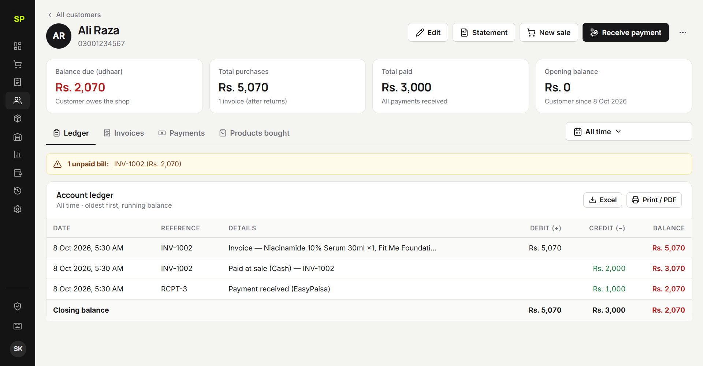
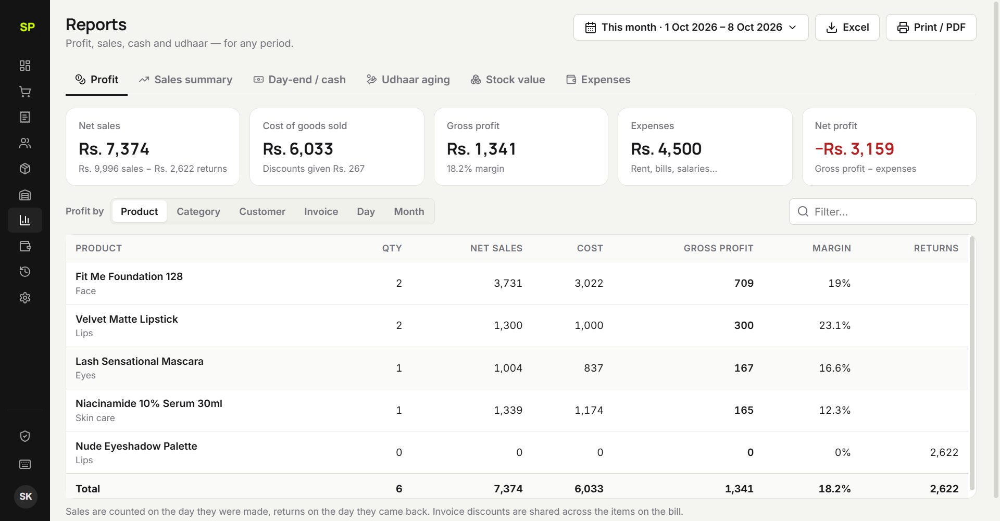
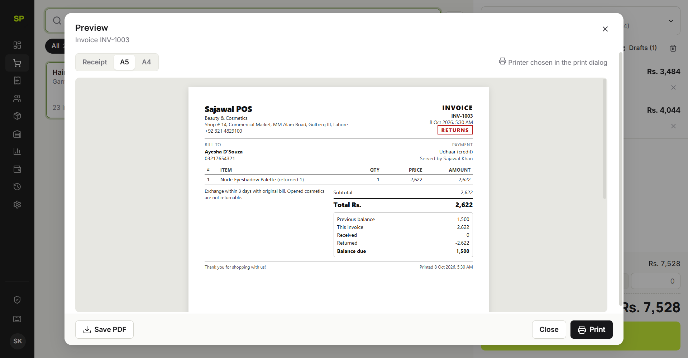

<div align="center">


# Sajawal POS

**Offline point of sale, inventory and udhaar (credit) ledger for beauty & cosmetics retail.**

[](docs/CHANGES.md)
[](#installation)
[](tests/services.test.js)
[](#license)

[](https://www.electronjs.org/)
[](https://nodejs.org/)
[](https://nodejs.org/api/sqlite.html)
[](https://developer.mozilla.org/docs/Web/JavaScript)
[](https://developer.mozilla.org/docs/Web/HTML)
[](https://developer.mozilla.org/docs/Web/CSS)
[](https://www.chartjs.org/)
[](https://sheetjs.com/)
[](https://www.electron.build/)

</div>

---

<p align="center">
  
</p>

## Overview

Sajawal POS is a Windows desktop application for a single shop. It runs **fully offline**:
billing, stock, customers, udhaar, returns, reports and backups all live on the shop's computer.
There is no server, no subscription and no internet dependency.

All money and stock changes are **transactional** (SQLite, ACID): a sale is saved completely or
not at all. Amounts are stored as whole paisa, so totals never drift.

## Features

<table>
<tr>
<td width="50%" valign="top">

**Billing**
- Fast product search and **barcode scanning**
- Keyboard-first: F2 · F4 · F8 · F9 · F12 · Enter
- Special prices, flat or % discounts
- **Split payments**: Cash · EasyPaisa · JazzCash · Card · Bank
- Collect **old udhaar together with the new bill**
- Park and resume sales
- **Privacy mode** hides amounts from customers

</td>
<td width="50%" valign="top">

**Customers & udhaar**
- Customer accounts with phone numbers
- Full **ledger** with running balance and any date range
- Payments settle the oldest bills first
- Printable / PDF / Excel **statements**
- **Udhaar aging** (0–30 / 31–60 / 61–90 / 90+ days)

</td>
</tr>
<tr>
<td valign="top">

**Inventory**
- Stock in / out / count with a full **movement log**
- Per-product history: received, sold, returned, buyers
- Low-stock and **expiry** alerts
- Receive supplier deliveries in one step
- Excel import with column mapping and preview

</td>
<td valign="top">

**Returns & corrections**
- Partial returns and full cancellations
- Correct refunds (cash or account credit)
- Invoice editing with revision history
- Permanent, searchable **activity log**

</td>
</tr>
<tr>
<td valign="top">

**Reports**
- Dashboard for **any date range**, compared with the previous period
- Profit by product · category · customer · invoice · day · month
- **Day-end cash report** by payment method
- Stock valuation, expenses, net profit
- Excel export and print / PDF for everything

</td>
<td valign="top">

**Printing, security & safety**
- Compact 80/58 mm receipts, **A5** and A4 invoices, with preview
- Exact paper size sent to the printer (no clipping)
- **Owner PIN**: lock pages and sensitive actions
- **Automatic backups** + second backup folder + one-click restore
- Strict CSP, sandboxed renderer, single-instance lock

</td>
</tr>
</table>

## Screenshots

| Checkout | Customer ledger |
|---|---|
|  |  |
| **Profit report** | **A5 invoice preview** |
|  |  |

## Installation

Download from the release and run one of:

| File | Use |
|---|---|
| `Sajawal-POS-Setup-<version>.exe` | **Recommended.** Installs the app with Desktop and Start-menu shortcuts and an uninstaller. |
| `Sajawal-POS-Portable-<version>.exe` | A single file that runs without installing (starts slower). |

Both use the same data folder: `%APPDATA%\sajawal-pos`. Upgrading from v1.x moves the old data in automatically on first start.

> The app is not code-signed. Windows SmartScreen may show *"Windows protected your PC"*. Choose **More info → Run anyway**.

## Development

**Requirements:** Windows 10/11, Node.js ≥ 22.12.

```bash
npm install
npm start              # run the app
npm test               # business-rule tests (stock, money, udhaar, returns, profit, PIN, import, migration)
npm run smoke          # opens every screen on a throw-away database and saves screenshots to smoke-out/
npm run print-check    # renders receipt / A5 / A4 to PDF and checks the paper sizes
npm run dist           # builds release/Sajawal-POS-Setup-*.exe and Sajawal-POS-Portable-*.exe
```

Set `SAJAWAL_USER_DATA=C:\some\folder` to run against a different data folder.

> If electron-builder fails with `spawn powershell.exe ENOENT`, add `C:\Windows\System32` and
> `C:\Windows\System32\WindowsPowerShell\v1.0` to `PATH`.

## Architecture

```
main.js · preload.js        Electron entry and a narrow, explicit IPC bridge (contextIsolation + sandbox)
src/main/
  db.js                     SQLite store: WAL, foreign keys, migrations, nested transactions
  services/                 Business rules: products & stock, customers & ledger, sales & returns,
                            payments & expenses, reports, settings, owner PIN, v1 data import
  backup.js · printing.js   Automatic backups / restore · per-document print windows and PDF
index.html · css/app.css    UI (strict Content-Security-Policy, offline fonts)
js/core/                    Escaped templating, API client, components, app shell, icons
js/views/                   One module per page
js/docs/                    Printable documents (receipt, A5/A4 invoice, statement, reports)
tests/                      node:test suite
scripts/                    Smoke test, print check, icon builders
```

The screen never touches the database. Every call goes through `window.bridge.api(...)` to the main
process, which validates the input, checks the owner-PIN permissions, and runs the operation in a transaction.

## Documentation

- [What changed in 2.0](docs/CHANGES.md): every fix and feature, with reasons
- [User guide](docs/USER-GUIDE.md): for shop staff
- [Original specification](docs/original-spec.md)

## License

Proprietary. © 2026 Sajawal POS. All rights reserved.
